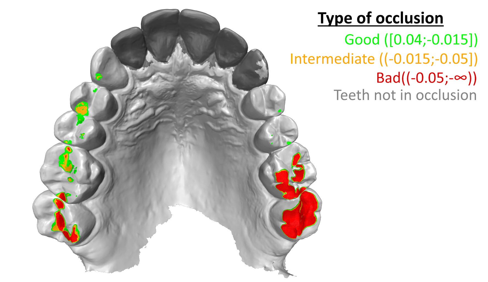

# Maxilla–Mandible Occlusion Analysis
A simple, Python-based occlusion estimation for maxilla–mandible models captured by intraoral scanners.

## Requirements (fol all script)
-   Python 3.12
-   PyTorch >= 2.7
-   CUDA >= 12.8
-   see requirements.txt for additional dependencies
- Both the maxilla and mandible models should be aligned in the bite position.
- Models should be in .stl file format.  
# How to use this repository:
This repository includes three script iterations:
1. ```OCCcompare.ipynb```: computes tooth occlusion between the mandible and maxilla using [libigl's]('https://libigl.github.io/libigl-python-bindings/igl_docs/#signed_distance') *signed_distance* function.
2.  ```OCCcompare+ML.ipynb```: computes tooth occlusion between the mandible and maxilla + tooth segmentation with [DilatedToothSegNet]('https://github.com/LucasKre/dilated_tooth_seg_net') and highlights teeth that have no contact.
3.  ```OCCcompare+ML+fast_simplification.ipynb```: computes tooth occlusion between the mandible and maxilla + tooth segmentation and highlighting teeth that have no contact + mesh simplification usin[pyvista]('https://github.com/pyvista/fast-simplification') (replacing the orignialy used Fast Quadric Mesh Reduction from Fast Quadric Mesh Reduction from [link]('https://github.com/Kramer84/pyfqmr-Fast-Quadric-Mesh-Reduction')).

To run these scripts, simply open Jupyter Notebook and execute them. Parameters that can be adjusted are defined inside the scripts.

The results are show as 3D image and tables:
```
----Number of file ----
All contact area: XXX mm²
Good contact (green): XXX mm²
Bad contact (red): XXX mm²
Intermediate contact (orange): XX mm²
```


## Docker
To build Docker
```bash
docker build -t OCCcompare_docker .
```
Conatiner can be started (Windows PowerShell)
```cmd
docker run -p 8888:8888 -e JUPYTER_TOKEN=12345 -d --gpus all -v "${PWD}:/app" --name dilatedtoothsegnet dilatedtoothsegnet
```
A Jupyter notebook can be started by opening the following in a browser:  http://localhost:8888/?token=12345 <br>
## Separate teeth highlight using DilatedToothSegNet
- For segmentation DilatedToothSegNet was used.
   - Model was train using [Teeth3DS dataset]('https://github.com/abenhamadou/3DTeethSeg_MICCAI_Challenges') with mixed maxilla and mandible 1200 models (referred to by the author as split 'S2'). Training parameters: ```n_bit_precision=16```, ```train_batch_size=2``` and ```epochs=100```. 
   - Training was performed NVIDIA RTX 4080 SUPER GPU.
   - Model weigts are in ML_param.ckpt file
> [!CAUTION]
> Be aware that your 3D teeth models better be aligned with the Teeth3DS dataset models. Both ML-based scripts include a correction step (get_pca_rotation), but it is not stable. Future improvements should include a better implementation to address this issue (eg. [AlignNet part]('10.1109/TMM.2023.3289760')).
